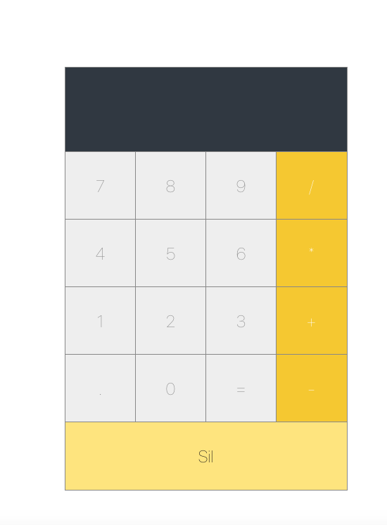

# React Hesap Makinesi
React ile yapılmış basit hesap makinesi.

# Kullanımı
Öncelikle belirlediğiniz bir dizinde terminal üzerinden nodeJS ile yeni bir react uygulaması oluşturuyoruz.
``` js
npx create-react-app hesap_makinesi
```
Ardından src/ dizininin içerisindeki tüm dosyaları silip, yerine buradaki src/ klasörünü kopyalıyoruz.
hesap_makinesi dizini içerisinde terminalden npm'i başlatıyoruz.
``` js
npm start
```
Ve sonrasında tarayıcımızda uygulama çalışıyor.<br><br>
Demo link;<br>
https://h80kj.csb.app/
<p align="center">
  
</p>

